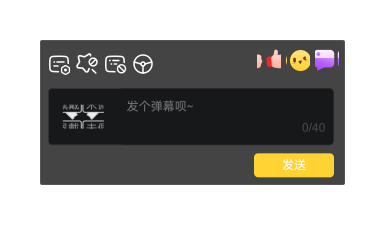
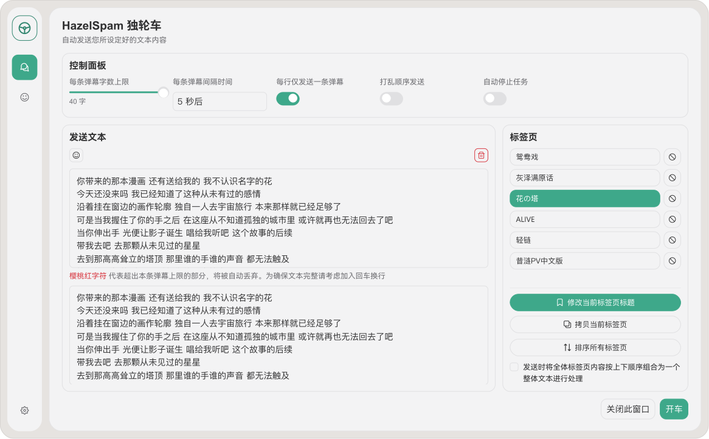
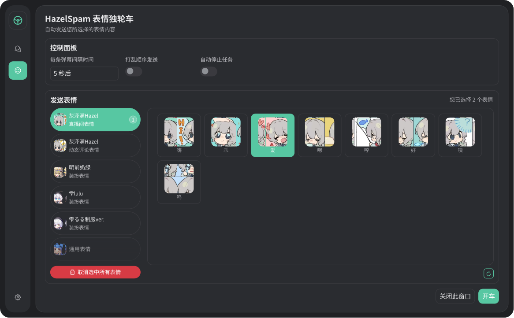
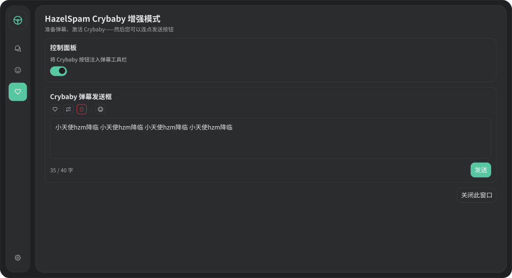

<div align="center">
  

[](https://hazel.idols.ltd/HazelSpam.min.user.js)
[](https://github.com/Yuuenn/HazelSpam/actions/workflows/ci.yml)
[](https://github.com/Yuuenn/HazelSpam/releases)
[](https://github.com/Yuuenn/HazelSpam)

# HazelSpam 灰宝独轮车
面向 B 站直播的后现代风格弹幕工具（ Tampermonkey 用户脚本 ）

特别感谢本 fork 来源 [BLSPAM](https://github.com/ADJazzzz/BLSPAM) 提供了足够好用的独轮车工具

**“绿冻车得太快就像龙卷风”**
</div>

## 安装

### 使用环境

- 浏览器需安装 [Tampermonkey](https://tampermonkey.net/) 扩展应用程序最新稳定版
- 若 Tampermonkey 版本 >= `5.3.2`，需在浏览器扩展管理页面`edge://extensions/`或`chrome://extensions/`开启`开发者模式`（右上角） / `开发人员模式`（左栏），同时需要在扩展详细页面开启`允许用户脚本`，参考 [官方说明](https://www.tampermonkey.net/faq.php#Q209)

### 安装步骤

1. 下载并访问 `HazelSpam.min.user.js` 或 `HazelSpam.user.js` 地址
<div align="center">
  <table align="center">
    <thead>
      <tr>
        <th>版本-来源</th>
        <th>HazelSpam.min.user（推荐）</th>
        <th>HazelSpam.user</th>
      </tr>
    </thead>
    <tbody>
      <tr>
        <td>EdgeOne Pages（正式发行源）</td>
        <td><a href="https://hazel.idols.ltd/HazelSpam.min.user.js">下载</a></td>
        <td><a href="https://hazel.idols.ltd/HazelSpam.user.js">下载</a></td>
      </tr>
      <tr>
        <td>Cloudflare 静态</td>
        <td>暂不可用</td>
        <td>暂不可用</td>
      </tr>
      <tr>
        <td>GitHub Release（备份）</td>
        <td><a href="https://github.com/Yuuenn/HazelSpam/releases/latest/download/HazelSpam.min.user.js">下载</a></td>
        <td><a href="https://github.com/Yuuenn/HazelSpam/releases/latest/download/HazelSpam.user.js">下载</a></td>
      </tr>
      <tr>
        <td>Greasyfork</td>
        <td>暂不可用</td>
        <td>暂不可用</td>
      </tr>
    </tbody>
  </table>
</div>

2. 按 Tampermonkey 提示完成脚本安装或升级
3. 打开任意 B 站直播间页面，确认聊天区附近出现 HazelSpam 入口按钮（方向盘图标）
4. 升级版本后，请使用 `Ctrl + Shift + R` 强制刷新页面

### 发行说明

- 正式发行源为 EdgeOne Pages 固定域名 `https://hazel.idols.ltd`
- 自动更新和应用内“检测更新”均读取 `https://hazel.idols.ltd/latest.json`
- GitHub Release 保留同版本产物，仅作为备份下载源

## 界面预览

### 主面板入口：弹幕工具栏 - 方向盘图标

<div align="center">

</div>

### 弹幕快捷操作：弹幕列表内联按钮

在直播间弹幕列表内可直接使用“复制弹幕 / 弹幕 +1”按钮。可实现快速填写弹幕框 / 快速复读弹幕。

<div align="center">

</div>

### 独轮车界面（浅色）

<div align="center">

</div>

### 表情独轮车界面（深色）

<div align="center">

</div>

### Crybaby 增强模式界面（深色）

<div align="center">

</div>


## 核心功能

- 文字独轮车：支持单文本/标签页来源、逐行/连续切分、顺序/随机发送、运行时长限制
- 表情独轮车：支持表情包选择、顺序/随机发送、运行时长限制，通用 emoji 自动降级为文本发送，并对表情资源做预热与状态保留
- 弹幕快捷操作：在直播间弹幕列表内直接注入“复制弹幕 / 弹幕 +1”按钮
- Crybaby 模式：包含自动调整弹幕、增加重复弹幕、清空弹幕框内容等快捷功能，一切为了您快速连点发送按钮的顺畅体验。 提供 Crybaby 弹幕发送面板，输入上限自动跟随当前直播间。您还可将 Crybaby 按钮注入直播间原生弹幕工具栏
- 设置中心：增强B站主题跟随行为（ 插件面板 <=> B 站 <=> 浏览器 ）、自动检查更新、自动发车、弹幕区滚动条开关等
- 文本标签页导入导出：支持将全部文本标签页导出为 `.toml`，并按追加模式导入当前标签页列表
- 工具栏方向盘状态提示：顺时针旋转不可用（未登录、接口异常等）；左右摇晃为独轮车运行中；回正状态代表待机

## 注意

- 使用前请先登录 B 站账号，否则无法正常发弹幕

## 配置导入说明

- 当前导入导出能力仅面向文本标签页 `.toml`
- 导入策略为“只追加，不覆盖现有标签页”
- 文件仅识别 `[[tabs]]` 下的 `title` 与 `text` 字段

```toml
[[tabs]]
title = "此处填写标题"
text = """第一行
第二行
所有文本用三引号包裹即可"""
```

## 开发

### 技术栈

- TypeScript（严格模式）
- Vue 3
- Pinia
- Vite
- vite-plugin-monkey
- PrimeVue

### 本地命令

```sh
pnpm install
pnpm dev
pnpm check
pnpm lint
pnpm test
pnpm typecheck
pnpm build
pnpm preview
pnpm format
```

更多贡献约定请阅读 [CONTRIBUTING.md](./CONTRIBUTING.md)。
更新记录请阅读 [CHANGELOG.md](./CHANGELOG.md)。
主题同步排查请阅读 [docs/bilibili-live-theme-model.md](./docs/bilibili-live-theme-model.md)。

## 兼容性

- 脚本管理器目前只对 Tampermonkey 做过兼容验证
- 浏览器建议使用最新版 Chrome、Edge（ Chromium 内核）或 Firefox
- 宿主页面结构可能随 B 站直播页面更新而变化，相关注入逻辑会持续跟进适配

## 风险与声明

- 本脚本会读取当前登录态并调用 B 站相关 API 以执行弹幕发送等功能
- 网络请求范围仅限业务所需域名（ B 站 API、EdgeOne 更新清单与构建依赖 CDN ）
- 使用脚本可能带来账号风控风险，请自行判断并承担使用后果

## 许可证

本项目采用 [MIT License](./LICENSE)。

## 灵感

- 项目灵感、配色方案设计灵感来源于虚拟主播灰泽满 Hazel。欢迎关注：[@灰泽满 Hazel](https://space.bilibili.com/1298779265)
- 但本项目与上述人物并无关系。
<div align="center">
	
</div>
